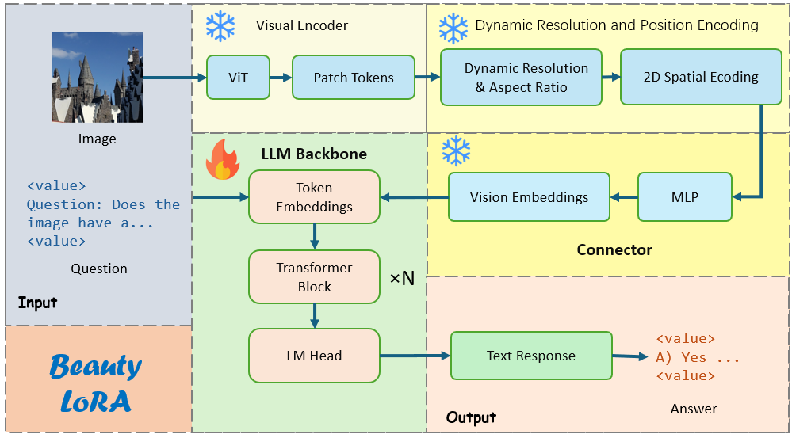

# Beauty-LoRA
LoRA fine-tuning of QWen3 on Aesthetic dataset


<div align="center">


This is the official repository for **Beauty-LoRA**.


</div>

</div>


## :bulb: LoRA for Qwen3-VL-8B

* **Inverse ISP**: Can be 





##  :hourglass: Environment

* We use python==3.11 and pytorch == 2.3.0  with CUDA version 11.8
* Training with NVIDIA GeForce V100 GPU is sufficient.
* Create environment:

```python
conda create --name lora python=3.11
conda activate lora
```

* Install the corresponding version pytorch:

```python
pip install torch==2.3.0 torchvision==0.18.0 torchaudio==2.3.0 --index-url https://download.pytorch.org/whl/cu118
```

* Install other dependency packages:

```python
pip install -r LoRA/requirements.txt
```


##  :clipboard: Dataset Preparation

* Adjust the data format to LoRA adaptation mode.


* main code:

```python
# 微调格式数据集
    dataset = []
    type = ['AesP', 'AesE', 'AesA1']
    for k,v in data.items():
        for t in type:
            Que = QAs[k][t]["Question"]  # 问题
            Opt = QAs[k][t]["Options"]  # 选项
            onedata = {
                "conversations": [
                    {
                        "value": f"<image>Question: {Que} Options: {Opt}",
                        "from": "human"
                    },
                    {
                        "value": v[t],
                        "from": "gpt"
                    }
                ],
                "images": [
                    "dataset/images/" + k
                ]
            }
            dataset.append(onedata)
```


##  :white_check_mark: How to Run

* Model training

```bash
bash train.sh
```

* Merge the fine-tuning module with the base module

```bash
bash lead_out_model.sh
```

* Perform reasoning

```python
python run.py
```


## 📧 Connecting with Us


If you have any questions, please feel free to send email to `hzcheng@chd.edu.cn`


## 📜 Acknowledgment


 This project is inspired by *Digital Video and HD: Algorithms and Interfaces*, *Deep Learning*( The Flower Book ), *Linear Algebra Done Right*, etc. 